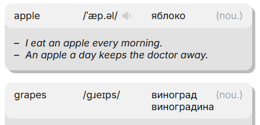

## What is Mnemo?

Mnemo is a web-based personal dictionary built on spaced repetition. It enriches entries with external metadata (transcription, audio, synonyms and antonyms) and provides multiple task types.

  
   
  <em>Isn't that charming?</em>

### Features

- **Personal Dictionary:** All users have a personal dictionary for their vocabulary. Vocabulary management is based on optimistic updating and a friendly interface.
- **Repetition System:** Mnemo uses a modified SM2 algorithm that combines automatic quality scoring with manual feedback adjustment. In this way, it's an improved classical spaced repetition algorithm.
- **Progress Tracking:** A visual calendar tells you about planned entries.
- **Adaptive Task Types:** The system scales the difficulty down, giving you simpler exercises until you're confident again.
- **Timed Enrichment:** A background service fetches metadata when you add or update an entry, but it never overwrites your custom data.

## Technical

The project is built as a full-stack application:

- **Frontend:** Vue.js (Composition API), TypeScript, Router, Pinia.
- **Backend:** C#, ASP.NET Core, Entity Framework Core.
- **Tooling & Validation:** AutoMapper, FluentValidation, JWT Bearer.
- **Database:** SQLite with EF migrations.
- **External:** Free Dictionary Api to enrichment.

Successful architectural solutions, in my opinion:

- **Polymorphic Task Factory:** Different task types are generated via factory pattern. Each type have own class.
- **Eliminated the `RepetitionSession` Entity:** It was just a container with no business logic - users never needed more than one session.
- **Atomic Background Enrichment:** Batch enrichment with entries capture and fixed N+1 `SaveChanges()`.

## Attribution & License

This project uses the _[Free Dictionary API](https://dictionaryapi.dev/)_, which sources its data from _[Wiktionary](https://www.wiktionary.org/)_.  
The dictionary data is licensed under the **Creative Commons Attribution-ShareAlike 3.0 Unported License** _([CC BY-SA 3.0](https://creativecommons.org/licenses/by-sa/3.0/))_.
