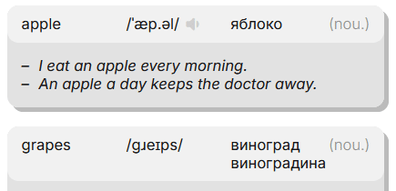

## What is Mnemo?

Mnemo (pron. "(m)ˈnimə") is a vocabulary tool built on spaced repetition that offers a friendly environment for language learning.
It's an independent project, driven by enthusiasm and a genuine desire to provide a pressure-free, self-paced experience.

<div align="center">
  
  <br/>
  <em>(Isn't that charming?)</em>
</div>

### Features

- **Personal Dictionary:** Users have a private personal dictionary for their vocabulary with the option to exchange entries as vocabulary packs. Management is based on optimistic updating and a smooth UI/UX.
- **Spaced Repetition System:** Mnemo uses a modified SM2 algorithm that combines automatic quality scoring with manual feedback adjustment. In this way, it's an improved classical spaced repetition algorithm.
- **Progress Tracking:** A visual calendar tells you about planned entries.
- **Adaptive Exercises:** Mnemo scales the difficulty down, giving you simpler exercises until you're confident again.
- **Smart Enrichment:** New or edited entries are automatically enhanced with useful translations, examples, or pronunciation data. Your own custom edits are always preserved and never overwritten.

### Upcoming

- **Multi-Language Support:** This requires some codebase refactoring, which is already being rolled out gradually in updates.
- **Smart Articles:** Each entry will get an article based on its part of speech. Gendered articles (in Spanish, French, German, etc.) will be determined by word endings, which should cover most cases.

## Getting Started

If you want **to try Mnemo** without installing anything, it's **[available here](https://mnemvocab.ru)**.  
Join our _[Telegram channel](https://t.me/mnemvocab)_ for news and updates.

### > Docker (Recommended)

**Prerequisite:** Docker and Docker Compose must be installed on your system.

```bash
git clone https://github.com/jadon-lotsman/Mnemo
cd Mnemo
cp .env.example .env
nano .env   # Edit .env to set your own JWT_KEY
docker compose up --build
```

Database file is stored in `./data/dev.db` (default).

### > Partially running

**Prerequisites:** .NET 8 SDK, dotnet-ef (optional, for migrations) for backend and Node.js 22 for frontend.

Start Backend:

```bash
cd Mnemo.Api
cp appsettings.Example.json appsettings.json
dotnet ef database update
dotnet run
```

Start Frontend:

```bash
cd Mnemo.Vue
npm install
npm run dev
```

## Technical

Mnemo is built as a full-stack application:

- **Frontend:** Vue.js (Composition API), TypeScript.
- **Backend:** C#, ASP.NET Core, EF Core.
- **Tooling & Validation:** AutoMapper, FluentValidation, JWT Bearer.
- **Infrastructure:** Docker, Nginx, SQLite with EF migrations.
- **External:** Free Dictionary API to enrichment.

Successful architectural solutions, in my opinion:

- **Polymorphic Task Factory:** Different task types are generated via factory pattern. Each type have own class.
- **Eliminated the `RepetitionSession` Entity:** It was just a container with no business logic - users never needed more than one session.
- **Atomic Background Enrichment:** Batch enrichment with entries capture and fixed N+1 `SaveChanges()`.

## Attribution & License

This project uses the _[Free Dictionary API](https://dictionaryapi.dev/)_, which sources its data from _[Wiktionary](https://www.wiktionary.org/)_.  
The dictionary data is licensed under the **Creative Commons Attribution-ShareAlike 3.0 Unported License** _([CC BY-SA 3.0](https://creativecommons.org/licenses/by-sa/3.0/))_.
