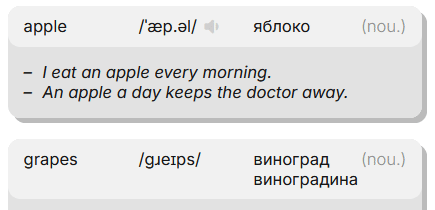

## What is Mnemo?

Mnemo (pron. "(m)ˈnimə") is a vocabulary tool built on spaced repetition that offers a friendly environment for language learning.  
It's an independent project, driven by enthusiasm and a genuine desire to provide a pressure-free, self-paced experience.

<div align="center">
  
  <br/>
  <em>(Isn't that charming?)</em>
</div>

### Features

- **Personal Dictionary:** Users have private vocabulary collections you can make public or share via link. Management is based on optimistic updating and a smooth UI/UX.
- **Spaced Repetition System:** Mnemo uses a modified SM2 algorithm that combines automatic quality scoring with manual feedback adjustment. In this way, it's an improved classical spaced repetition algorithm.
- **Progress Tracking:** A visual calendar tells you about planned entries.
- **Adaptive Exercises:** Mnemo scales the difficulty down, giving you simpler exercises until you're confident again.
- **Smart Enrichment:** New or edited entries are automatically enhanced with useful translations, examples, or pronunciation data. Your own custom edits are always preserved and never overwritten.

### Upcoming

- **Multi-Language Support:** This requires some codebase refactoring, which is already being rolled out gradually in updates.
- **Smart Articles:** Each entry will get an article based on its part of speech. Gendered articles (in Spanish, French, German, etc.) will be determined by word endings, which should cover most cases.

## Getting Started

Try Mnemo live on _[mnemvocab.ru](https://mnemvocab.ru)_.  
Follow the telegram channel (_[@mnemvocab](https://t.me/mnemvocab)_) for news and updates.

### > Run with Docker (Recommended)

**Prerequisite:** Docker and Docker Compose must be installed on your machine.

```bash
git clone https://github.com/jadon-lotsman/Mnemo
cd Mnemo
cp .env.example .env
nano .env   # Set database credentials, JWT settings
docker compose up --build
```

Database is persisted in the `pgdata` Docker volume. To wipe it:

```bash
docker compose down -v
```

#### Production docker profile

Edge nginx and certbot containers are behind the `prod` profile, so they do not start locally.

```bash
docker compose -f docker-compose.yml --profile prod up -d --build
```

### > Running locally for development

**Prerequisites:** .NET 8 SDK, Node.js 22, dotnet-ef (optional, for migrations) and Docker (for PostgreSQL image).

#### Configure `.env`:

The `db` container reads its configuration from `.env`.

```bash
cp .env.example .env
nano .env   # Set connection
```

#### Configure `appsettings.Development.json`:

The backend does **not** read `.env`, it reads `appsettings.Development.json` config. The database name and credentials in both files must match.

Copy `appsettings.json` as a template, uncomment `ConnectionStrings` and `Jwt` sections, and replace the placeholder values.

```bash
cd Mnemo.Api
cp appsettings.json appsettings.Development.json
nano appsettings.Development.json
```

#### Start the database:

```bash
# From the repo root
docker compose up -d db
```

If you have a native PostgreSQL running locally, skip this step and point
`ConnectionStrings:DefaultConnection` to your instance.

#### Start backend:

Available at `http://localhost:8080`.

```bash
cd Mnemo.Api
dotnet run
```

Migrations are applied automatically on startup in Development. To apply them manually:

```bash
dotnet ef database update
```

#### Start frontend:

Available at `http://localhost:5173`.

```bash
cd Mnemo.Vue
npm install
npm run dev
```

## Technical

Mnemo is built as a full-stack application:

- **Frontend:** Vue.js (Composition API), TypeScript.
- **Backend:** C#, ASP.NET Core, EF Core.
- **Tooling & Validation:** AutoMapper, FluentValidation, JWT Bearer.
- **Infrastructure:** Docker, Nginx, PostgreSQL with EF migrations.
- **External:** Free Dictionary API for enrichment.

Successful architectural solutions, in my opinion:

- **Polymorphic Task Factory:** Different task types are generated via factory pattern. Each type has its own class
- **Eliminated the `RepetitionSession` Entity:** It was just a container with no business logic - users never needed more than one session.
- **Atomic Background Enrichment:** Batch enrichment with entries capture and fixed N+1 `SaveChanges()`.

## Attribution & License

This project uses the _[Free Dictionary API](https://dictionaryapi.dev/)_, which sources its data from _[Wiktionary](https://www.wiktionary.org/)_.  
The dictionary data is licensed under the **Creative Commons Attribution-ShareAlike 3.0 Unported License** _([CC BY-SA 3.0](https://creativecommons.org/licenses/by-sa/3.0/))_.
